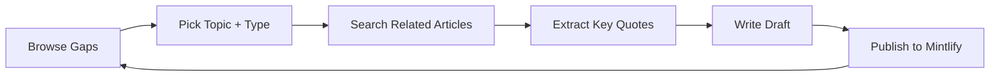

# Content Gap Analysis

Identify which topics need more content and what types (tutorial, how-to, reference, explanation) are missing.

<Info>
  The previous interactive gap dashboard has been removed because the external
  deployment no longer exists. Use the guide below to spot coverage gaps from
  local content pages, then create new drafts from `/kb/search`.
</Info>

## Understanding the Matrix

The gap dashboard shows a **topic × content type** matrix:

<Steps>
  <Step title="Red cells (0)">
    No content exists for this topic/type combination — **opportunity!**
  </Step>
  <Step title="Yellow cells (1-2)">
    Light coverage — consider adding more
  </Step>
  <Step title="Blue cells (3-5)">
    Good coverage
  </Step>
  <Step title="Green cells (6+)">
    Strong coverage — focus elsewhere
  </Step>
</Steps>

## Using Gaps for Content Planning

### 1. Find High-Value Opportunities

Look for topics with:
- **High total coverage** but **missing types** — readers are interested, but specific formats are missing
- Example: "AI Agents" has 14 articles but 0 reference docs

### 2. Convert Existing Content

Use the Diátaxis conversion patterns:

| From | To | Strategy |
|------|------|----------|
| Explanation → Tutorial | Turn concepts into hands-on lessons |
| Explanation → How-to | Extract actionable steps from theory |
| Tutorial → Reference | Document the specifics introduced |
| How-to → Explanation | Add context and reasoning |

### 3. Track Your Progress

Use the `my_content` table to track:
- Ideas sourced from scraped articles
- Drafts in progress
- Published content

<Note>
  The gap dashboard automatically updates as new content is scraped. Check back weekly to see how coverage evolves.
</Note>

## Content Creation Workflow

<Card title="Start Creating" icon="pen" href="/kb/search">
  Use semantic search to find source material for your next piece
</Card>
